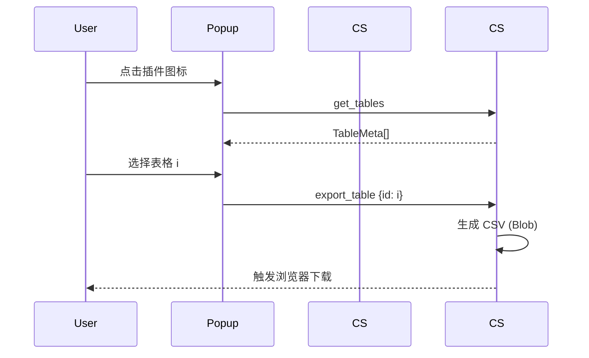

# 网页表格导出 CSV 插件设计方案

> 使用 [wxt](https://github.com/wxt-dev/wxt) + React + TypeScript 开发，聚焦核心功能实现，不涉及构建与发布细节。

---

## 1. 目标概述
1. 在任意网页点击插件图标（Popup）后，扫描当前页面所有 `<table>` 元素。
2. 以列表形式展示各表格的预览信息（行×列、前几个单元格文本）。
3. 用户点击某一表格条目后，立即生成对应 CSV 文件并触发浏览器下载。

## 2. 技术架构
| 角色            | 职责 | 关键技术 |
|----------------|------|----------|
| **Content Script** | 运行于被访问页面，负责 DOM 扫描、表格数据采集及 CSV 生成 | DOM API、`document.querySelectorAll`、CSV 序列化 | 
| **Popup (React)**  | 插件弹窗 UI，展示表格列表并触发导出操作 | React 18、TypeScript、Tailwind/AntD 任意 UI 库 | 
| **Background (可选)** | 受理长任务或统一文件下载逻辑（当前体量可暂省略） | Service Worker | 
| **Messaging**   | Popup ↔ Content Script 通信 | `browser.tabs.sendMessage`、`browser.runtime.onMessage` |

> WXT 会帮我们生成 Manifest V3 并托管打包逻辑，目录约定与 Vite 保持一致。

## 3. 目录结构（建议）
```
entrypoints/
 ├─ content.ts          # 内容脚本
 ├─ popup/
 │   ├─ App.tsx
 │   ├─ components/
 │   │   ├─ TableList.tsx
 │   │   └─ TableItem.tsx
 │   └─ styles.css
 └─ manifest.ts         # 由 wxt 提供的 manifest 定义（若需要额外配置）

public/
 └─ icons/              # 扩展 icon 资源
```

## 4. 关键数据结构
```ts
// 来自内容脚本
export interface TableMeta {
  id: string;            // 随机或索引生成，用于再次定位
  rows: number;
  cols: number;
  preview: string;       // 前几格文本，便于用户辨识
}
```

## 5. 主要流程


### 5.1 内容脚本职责
1. 监听来自 Popup 的两类消息：`get_tables`、`export_table`。
2. `get_tables` 时：
   - 扫描 `document.querySelectorAll('table')`，过滤隐藏表格。
   - 生成 `TableMeta[]` 并返回。
3. `export_table` 时：
   - 根据 id 定位表格元素。
   - 遍历行列，读取 `innerText`，转义 `"`、`,`、`\n`。
   - 构造 CSV 字符串，使用 `new Blob([csv], {type: 'text/csv'})`。
   - 创建临时 `<a download>`，赋 `URL.createObjectURL(blob)`，自动点击后 revoke。

### 5.2 Popup 组件职责
1. 首次渲染 `useEffect` 中向激活 Tab 发送 `get_tables`。
2. 接收 `TableMeta[]` 更新状态并渲染列表。
3. 点击列表项：
   - 调用 `browser.tabs.sendMessage(activeTabId, {type: 'export_table', id})`。
   - 可展示 Toast 或 Spinner，直至内容脚本反馈（可选）。

## 6. 权限 & Manifest
```ts
export default defineManifest({
  manifest_version: 3,
  name: 'Webpage Table Exporter',
  action: {
    default_title: 'Export Table as CSV',
    default_popup: 'entrypoints/popup/index.html',
  },
  permissions: ['tabs', 'activeTab'],
  content_scripts: [
    {
      matches: ['<all_urls>'],
      js: ['entrypoints/content.ts'],
    },
  ],
});
```
* 由于仅操作当前 Tab DOM，`host_permissions` 可留空或 `"<all_urls>"`。

## 7. CSV 生成实现细节
- **换行处理**：单元格文本中如含 `\n`，需包围双引号并替换为 `\n`。
- **逗号 & 引号**：若文本含 `,` 或 `"`，需整体用 `"..."` 包围，内部 `"` 双写。
- **UTF-8 BOM**：为兼容 Excel，可在文件头加入 `\ufeff`。

```ts
function tableToCsv(table: HTMLTableElement): string {
  const rows = Array.from(table.rows);
  return '\ufeff' + rows.map(r =>
    Array.from(r.cells).map(c => escapeCsv(c.innerText)).join(',')
  ).join('\r\n');
}

function escapeCsv(text: string) {
  const needsQuote = /[",\n]/.test(text);
  let res = text.replace(/"/g, '""');
  return needsQuote ? `"${res}"` : res;
}
```

## 8. 错误处理
- 页面无表格 → Popup 显示空态提示。
- DOM 修改导致表格失效 → `export_table` 前再次校验元素存在。
- 大表格性能 → 流式遍历、避免过多字符串拼接，可采用 `join()`。

## 9. 测试方案
- 在包含多表格的示例页面（如 Wikipedia、博客文章）验证导出。
- 验证包含合并单元格 (`rowspan/colspan`) 的表格输出合理（当前简单导出可忽略合并单元格复杂性）。
- 不同浏览器（Chrome / Edge / Firefox）安装并 smoke test。

## 10. 后续可扩展功能（非本期交付）
- 支持多表格一次性合并导出为单一 CSV / ZIP。
- 支持导出为 XLSX、JSON、Markdown 等格式。
- 提供列勾选、过滤、预览编辑能力。
- 记忆上次导出配置 & 样式化 UI。

---

> 本方案满足最小可用功能（MVP），后续可按需求演进。
